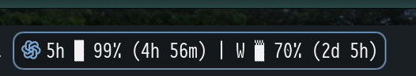
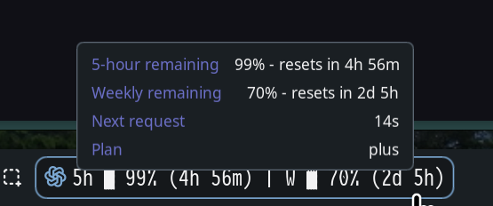

Please refer to the documentation for [noctalia](https://github.com/noctalia-dev/noctalia) on how to install the plugin.

# Codex Usage

Shows remaining Codex usage in the Noctalia bar for the 5-hour and weekly windows, including each window's reset countdown.

The plugin reads your local Codex authentication file and queries ChatGPT's Codex usage endpoint.

## Showcase

| Widget                                | Details                                |
| ------------------------------------- | -------------------------------------- |
|  |  |

## Features

- Displays remaining usage for the 5-hour window.
- Displays remaining usage for the weekly window.
- Shows reset countdown information for both windows.
- Optionally shows the account email in the widget.
- Supports configurable auth file path, endpoint, request delay, and gauge characters.

## Requirements

- Noctalia `5.0.0` or newer.
- A readable Codex auth file. The default path is `~/.codex/auth.json`.
- An auth file that contains `tokens.access_token`; `tokens.account_id` is used when present.

## Settings

- `auth_file`: path to the Codex auth JSON file. Defaults to `~/.codex/auth.json`.
- `endpoint`: usage endpoint URL. Defaults to `https://chatgpt.com/backend-api/wham/usage`.
- `request_delay_seconds`: minimum delay between completed requests. Defaults to `30` seconds.
- `show_account`: whether to show the account email in the widget.
- `gauge_0` to `gauge_8`: characters used to render the usage gauge.

## Authentication Notice

Please check `~/.codex/auth.json` yourself and confirm what `auth_mode` is using `codex` or `chatgpt`, and whether you are using an API key.

My `auth_mode` is `chatgpt`, and i login through the browser redirect flow instead of using an API key. If your login method is different from mine, please open an issue or modify the code yourself.
